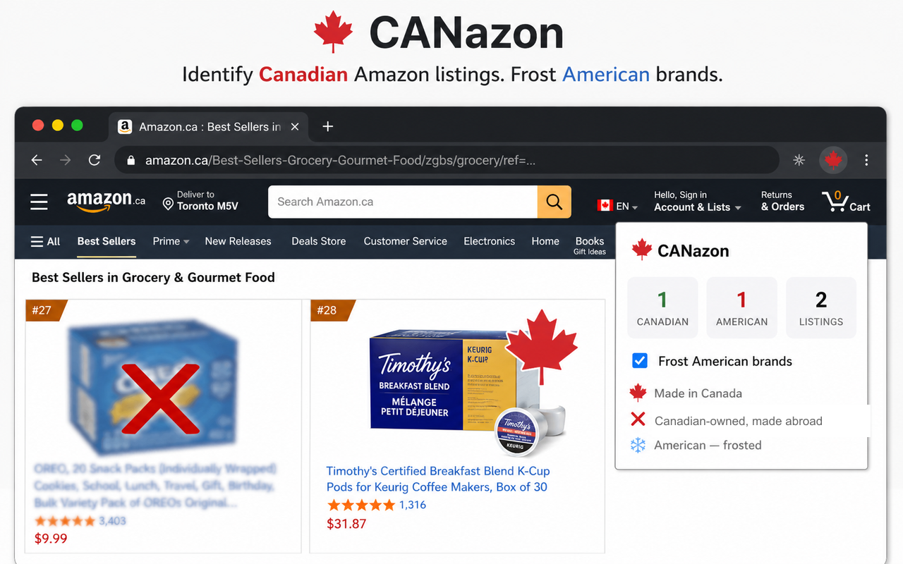

# CANazon

## [Install CANazon from the Chrome Web Store →](https://chromewebstore.google.com/detail/canazon-buy-canadian/kfeobiokdejmibohjjofajkbhfiblohk?authuser=0&hl=en-US)

CANazon is a small Chrome extension that makes Canadian brands easier to spot while shopping on Amazon.

- Made in Canada brands get a solid red maple-leaf badge.
- Canadian-owned brands made abroad get a white maple-leaf badge outlined in red.
- Recognized American brands get heavy frost and a red X.
- Click **Reveal** to uncover a frosted listing.
- Unknown brands stay visible.

## What it looks like



## Install version 0.2 from the ZIP

Chrome cannot install the ZIP directly. Unzip it first.

1. Download [`CANazon-0.2.zip`](CANazon-0.2.zip).
2. Double-click the ZIP to extract it.
3. Open `chrome://extensions` in Chrome.
4. Turn on **Developer mode**.
5. Click **Load unpacked**.
6. Select the extracted `CANazon-0.2` folder—the folder containing `manifest.json`.
7. Open or refresh an Amazon page.

To update CANazon later, replace the extracted folder with the new version and click **Reload** on the CANazon card in `chrome://extensions`.

## Where it works

CANazon handles Amazon search results, category grids, category-specific Best Sellers pages, and the standard product cards on Amazon.ca home and Deals pages. Storefront and recommendation cards may not be supported yet.

Brand matching is based on bundled title and brand lists. It is a shopping aid, not a guarantee of ownership or manufacturing origin.

## Privacy

CANazon runs locally in Chrome. It has no accounts, tracking, analytics, or extension-runtime network requests.

## Development

Load this repository with **Load unpacked**, then run:

```bash
node --test tests/*.test.mjs
```

Canadian brand data is compiled from the r/BuyCanadian community wiki. Code is MIT licensed.
